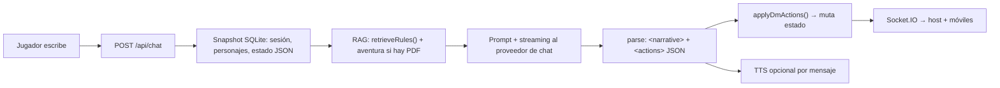
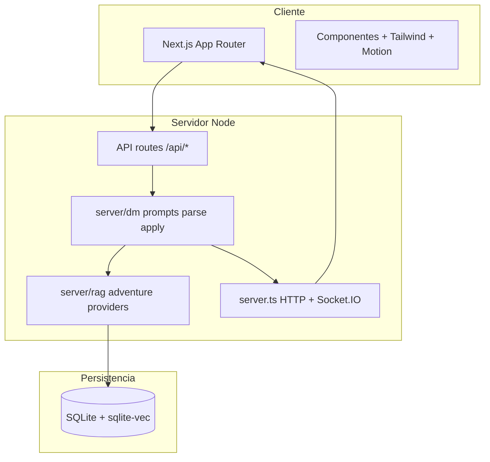

<p align="center">
  
</p>

<h1 align="center">Mesa</h1>

<p align="center">
  <strong>Plataforma de rol local-first donde la inteligencia artificial impulsa toda la experiencia de juego</strong><br/>
  narración, consulta de reglas, voz, escenas visuales y sincronización multidispositivo alrededor de un motor real de D&amp;D 5E.
</p>

<p align="center">
  <a href="https://nextjs.org/"></a>
  <a href="https://www.typescriptlang.org/"></a>
  <a href="https://socket.io/"></a>
  <a href="https://www.sqlite.org/"></a>
  <a href="https://ollama.com/"></a>
  <a href="https://tailwindcss.com/"></a>
</p>

---

## Visión: la IA no es un accesorio, es el motor de la mesa

En **Mesa**, el modelo de lenguaje actúa como **Dungeon Master**: interpreta intención, mantiene coherencia narrativa y emite **acciones estructuradas** que el servidor aplica sobre un estado de partida real (HP, mapa, dados, inventario). Eso evita el patrón «chatbot + anotaciones manuales» y acerca el flujo a una mesa física digitalizada.

| Capa | Qué hace la IA / la automatización |
|------|-------------------------------------|
| **Narrativa (LLM)** | Genera ficción, diálogo del mundo y decisiones de tono; opera en modos **auto** (DM pleno) y **asistente**. |
| **Reglas (RAG)** | Antes de cada respuesta, **recupera fragmentos del Player's Handbook** (vectores + FTS) para anclar mecánicas y reducir invención de reglas. |
| **Aventura (RAG opcional)** | Si subes un **PDF de módulo**, se indexa por historia: el DM usa ese material como fuente de verdad donde exista texto; improvisa solo en silencios del documento. |
| **Voz (TTS)** | Cada mensaje de narración puede leerse en alto: **TTS del sistema** (sin API), OpenAI, ElevenLabs o **Web Speech** en el cliente. |
| **Visuales** | Mapas, retratos y fondos con proveedores de imagen (o lienzo procedural con niebla y cuadrícula si está desactivado). |

Flujo resumido del turno del DM:



---

## Por qué no es «otro wrapper de ChatGPT»

- **Motor 5E real** en TypeScript (`lib/rules-engine`, esquemas Zod): la IA opera *sobre* reglas y estado persistidos, no solo sobre texto libre.
- **Salida contractual**: el modelo devuelve bloques **`<narrative>`** y **`<actions>`**; el servidor valida y aplica — menos parsing frágil y más control de juego.
- **Local-first**: por defecto **Ollama** + embeddings **`nomic-embed-text`** + TTS de sistema (`say` / `espeak-ng`). Sin claves en la nube puedes jugar en LAN.
- **BYOK cifrado**: claves opcionales (OpenAI, Anthropic, Gemini, OpenRouter, Groq, xAI, Stability, ElevenLabs) en panel de ajustes, **AES-256-GCM** en reposo (`data/.keyring`).
- **Multidispositivo**: QR en la mesa del anfitrión; compañeros en **`/play/[sessionId]`** con chat, dados y estado en tiempo real.

---

## Procesos técnicos (detalle)

### 1. Servidor híbrido `server.ts` + Next.js

No es solo `next dev`: **`tsx server.ts`** crea un **HTTP server de Node**, adjunta **Next** como request handler y monta **Socket.IO** en el mismo puerto (`path: /socket.io`). Así las rutas `/api/*` y las páginas App Router conviven con **WebSockets** para fan-out de estado sin un backend separado.

### 2. Ingesta RAG del Player's Handbook

`npm run ingest:handbook` ejecuta `scripts/ingest-handbook.ts`:

1. **Extracción** de texto del PDF del PHB (pdf.js).
2. **Chunking** por secciones lógicas (`server/rules/chunker.ts`).
3. **Embeddings** vía Ollama (`embed` en `server/ollama.ts`) con `DND_EMBED_MODEL` (por defecto `nomic-embed-text`).
4. **Persistencia** en SQLite: tablas de chunks + índice vectorial **`sqlite-vec`** (`handbook_vec`) y, cuando aplica, **FTS** (`handbook_fts`) para BM25.

En tiempo de juego, `retrieveRules()` (`server/rag.ts`) combina **búsqueda vectorial** (similitud coseno / distance en sqlite-vec) con **fallback o refuerzo FTS** si el vectorial falla o falta índice — el resultado se inyecta en el prompt del DM con presupuesto de tokens (`server/dm/prompt-budget.ts`).

### 3. Turno de chat `POST /api/chat` (`app/api/chat/route.ts`)

1. Carga **sesión** y **historia** desde **better-sqlite3** (`lib/db.ts`).
2. Parsea `state_json` (mapa de batalla, iniciativa, resumen, tono, dificultad, etc.).
3. Ensambla **jugadores** con sus hojas (`character.data_json`).
4. **RAG de reglas** según el texto del jugador y el modo de combate.
5. Si la historia tiene **PDF de aventura**, `retrieveAdventure` / outline (`server/adventure.ts`) aporta contexto de módulo.
6. Construye el prompt (`server/dm/prompts.ts`: `buildAutoDmPrompt` / `buildAssistantDmPrompt`, tracker de combate, etc.).
7. **Streaming** al proveedor configurado (`server/providers/chat.ts`: Ollama, OpenAI-compatible, Anthropic, Gemini…).
8. Al cerrar el stream: **`parseDmResponse`** extrae narrativa y JSON de acciones.
9. **`applyDmActions`** (`server/dm/apply-actions.ts`) muta estado (dados pedidos, HP, tokens en grid, objetos, flags de escena…).
10. Persiste en SQLite y emite eventos por **`getIo()`** (`server/io-bus.ts`) a clientes Socket.IO.

Para optimizar tokens de entrada existe el runbook [docs/llm-token-reduction-runbook.md](docs/llm-token-reduction-runbook.md) y el script `npm run measure:dm-prompts`.

### 4. Tiempo real (Socket.IO)

`server/socket.ts` registra handlers; el cliente (mesa + móvil) se suscribe a la misma URL LAN. Cada mutación relevante del estado se **fan-out** a todos los asientos: la mesa principal y los teléfonos permanecen coherentes sin polling agresivo.

### 5. TTS `POST /api/tts` (`app/api/tts/route.ts` + `server/system-tts.ts`)

- **Sistema**: macOS usa **`/usr/bin/say`** y convierte a WAV con **`afconvert`**; Linux usa **`espeak-ng`**.
- **Cloud**: OpenAI / ElevenLabs según ajustes.
- **Cliente**: si el servidor no puede sintetizar, el navegador puede usar **Web Speech API**.

### 6. Imágenes `POST /api/image` (`server/providers/image.ts`)

El mismo panel de proveedores enruta a OpenAI, Google Imagen, Stability o xAI Imagine; si la generación está desactivada o falla, la UI mantiene **canvas procedural** (rejilla, niebla, tokens).

### 7. Personajes y PDF

El asistente de creación (`/character/new`) persiste en SQLite; **`GET /api/character/[id]/pdf`** genera una **hoja rellenable en español** vía `pdf-lib` (`server/character-pdf.ts`).

---

## Funciones principales

| Ruta | Rol |
|------|-----|
| **`/`** | La Bóveda: historias y personajes. |
| **`/story/new` → `/story/[id]`** | Sesión en vivo: narrador IA, chat lateral, lienzo con mapa, TTS por mensaje, opción de **subir PDF de aventura** (ingesta + resumen + RAG por historia). |
| **`/character/new`** | Constructor paso a paso (raza, clase, atributos, habilidades, exportación PDF). |
| **`/play/[sessionId]`** | Vista móvil (personaje, acciones, chat, dados) enlazada por QR en LAN. |
| **`/settings`** | Sala de control: proveedor por rol (chat / imagen / voz), claves cifradas, modo de dados, SFX, re-ingesta del manual. |

---

## Requisitos

- **Node.js ≥ 20**
- **[Ollama](https://ollama.com)** en `http://localhost:11434` (o `OLLAMA_HOST`)
  - `ollama pull gemma4:e2b` — narrador por defecto
  - `ollama pull nomic-embed-text` — embeddings RAG
- **TTS local**: en macOS no hace falta nada extra (`say` + `afconvert`). En Linux: `espeak-ng`.

---

## Instalación y arranque

```bash
git clone <tu-repo> && cd dnd
npm install
ollama pull nomic-embed-text
npm run ingest:handbook    # indexa el Player's Handbook (varios minutos)
npm run dev                # http://localhost:3000 (o PORT=3030)
```

La URL LAN para el QR la detecta el servidor automáticamente.

---

## Scripts

| Comando | Descripción |
|---------|-------------|
| `npm run dev` | Servidor Node + Next + Socket.IO (`tsx server.ts`) |
| `npm run build` / `npm start` | Build y producción |
| `npm run ingest:handbook [ruta-pdf]` | Reindexar el PHB |
| `npm run measure:dm-prompts` | Medir tamaño de prompts del DM |

---

## Variables de entorno

| Variable | Uso |
|----------|-----|
| `OLLAMA_HOST` | Por defecto `http://127.0.0.1:11434` |
| `DND_MODEL` | Modelo de chat Ollama por defecto (`gemma4:e2b`) |
| `DND_EMBED_MODEL` | Embeddings (`nomic-embed-text`) |
| `SYSTEM_TTS_VOICE` | Voz por defecto para TTS de sistema |
| `PORT` | Puerto HTTP (búsqueda de puerto libre si está ocupado) |
| `DND_SECRET` | Semilla para cifrado de claves; si falta, se genera `data/.keyring` |
| `OPENAI_API_KEY`, `ANTHROPIC_API_KEY`, `GEMINI_API_KEY`, … | *Fallback* si no guardaste la clave en `/settings` |

Las claves introducidas en la UI se cifran con **AES-256-GCM** y no salen del equipo.

---

## Arquitectura de carpetas



```
app/          Páginas y rutas API
server/       DM, RAG, aventura, TTS, sockets, red LAN, proveedores
lib/          Motor 5E, esquemas, acceso SQLite
components/   UI compartida
scripts/      Ingesta one-shot del manual
data/         BD, cachés, assets (gitignored)
```

**Stack:** Next.js 14 · TypeScript · Socket.IO · Tailwind · Framer Motion · better-sqlite3 · sqlite-vec · Ollama · pdf-lib · Zod.

---

## Roadmap

- Panel de encuentro (iniciativa, alcance por casilla).
- Biblioteca curada de mapas/tokens bajo `data/assets/`.
- Mezcla de SFX inline vía etiquetas `[sfx:*]` en el stream narrativo.

---

<p align="center">
  <em>Que los dados —y los embeddings— te favorezcan.</em>
</p>
