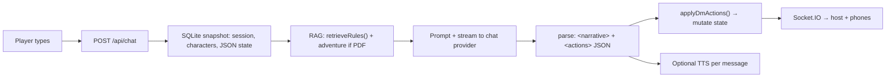
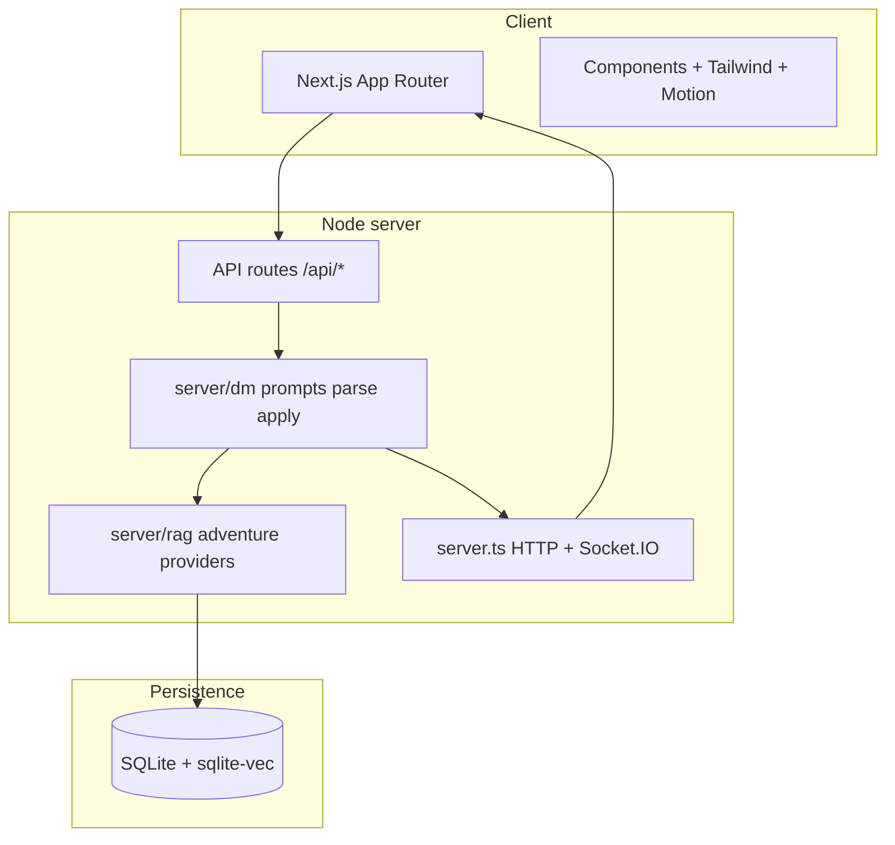

<p align="center">
  
</p>

<h1 align="center">Mesa</h1>

<p align="center">
  <strong>A local-first tabletop platform where artificial intelligence drives the entire play experience</strong><br/>
  narration, rules lookup, voice, visual scenes, and multi-device sync around a real D&amp;D 5E engine.
</p>

<p align="center">
  <a href="https://nextjs.org/"></a>
  <a href="https://www.typescriptlang.org/"></a>
  <a href="https://socket.io/"></a>
  <a href="https://www.sqlite.org/"></a>
  <a href="https://ollama.com/"></a>
  <a href="https://tailwindcss.com/"></a>
</p>

---

## Vision: AI is not a bolt-on — it is the engine of the table

In **Mesa**, the language model acts as **Dungeon Master**: it interprets intent, keeps narrative coherence, and emits **structured actions** the server applies to real session state (HP, map, dice, inventory). That avoids the “chatbot + manual notes” pattern and brings the flow closer to a digitalized physical table.

| Layer | What the AI / automation does |
|------|--------------------------------|
| **Narrative (LLM)** | Generates fiction, world dialogue, and tone; runs in **auto** (full DM) and **assistant** modes. |
| **Rules (RAG)** | Before each reply, **retrieves passages from the Player's Handbook** (vectors + FTS) to ground mechanics and reduce invented rules. |
| **Adventure (optional RAG)** | If you upload a **module PDF**, it is indexed per story: the DM treats that material as canonical wherever the text exists; it improvises only in gaps. |
| **Voice (TTS)** | Every narrative message can be read aloud: **system TTS** (no API), OpenAI, ElevenLabs, or **Web Speech** in the browser. |
| **Visuals** | Maps, portraits, and backdrops via image providers (or a procedural canvas with fog and grid when disabled). |

High-level DM turn flow:



---

## Why it is not “another ChatGPT wrapper”

- **Real 5E engine** in TypeScript (`lib/rules-engine`, Zod schemas): the AI operates *on top of* persisted rules and state, not only free text.
- **Contractual output**: the model returns **`<narrative>`** and **`<actions>`** blocks; the server validates and applies them — less brittle parsing, stronger game control.
- **Local-first** by default: **Ollama** + **`nomic-embed-text`** embeddings + system TTS (`say` / `espeak-ng`). You can play on LAN with no cloud keys.
- **Encrypted BYOK**: optional keys (OpenAI, Anthropic, Gemini, OpenRouter, Groq, xAI, Stability, ElevenLabs) in the settings panel, **AES-256-GCM** at rest (`data/.keyring`).
- **Multi-device**: QR on the host table; players on **`/play/[sessionId]`** with chat, dice, and live state.

---

## Technical processes (detail)

### 1. Hybrid `server.ts` + Next.js server

This is not plain `next dev`: **`tsx server.ts`** creates a **Node HTTP server**, mounts **Next** as the request handler, and attaches **Socket.IO** on the same port (`path: /socket.io`). `/api/*` routes and App Router pages share **WebSockets** for state fan-out without a separate backend.

### 2. Player's Handbook RAG ingest

`npm run ingest:handbook` runs `scripts/ingest-handbook.ts`:

1. **Text extraction** from the PHB PDF (pdf.js).
2. **Chunking** by logical sections (`server/rules/chunker.ts`).
3. **Embeddings** via Ollama (`embed` in `server/ollama.ts`) with `DND_EMBED_MODEL` (default `nomic-embed-text`).
4. **SQLite persistence**: chunk tables + **`sqlite-vec`** vector index (`handbook_vec`) and, where applicable, **FTS** (`handbook_fts`) for BM25.

At play time, `retrieveRules()` (`server/rag.ts`) combines **vector search** (cosine / distance in sqlite-vec) with **FTS fallback or boost** if vectors fail or the index is missing — results are injected into the DM prompt with a token budget (`server/dm/prompt-budget.ts`).

### 3. Chat turn `POST /api/chat` (`app/api/chat/route.ts`)

1. Load **session** and **story** from **better-sqlite3** (`lib/db.ts`).
2. Parse `state_json` (battle map, initiative, summary, tone, difficulty, etc.).
3. Assemble **players** with their sheets (`character.data_json`).
4. **Rules RAG** from player text and combat mode.
5. If the story has an **adventure PDF**, `retrieveAdventure` / outline (`server/adventure.ts`) adds module context.
6. Build the prompt (`server/dm/prompts.ts`: `buildAutoDmPrompt` / `buildAssistantDmPrompt`, combat tracker, etc.).
7. **Stream** to the configured provider (`server/providers/chat.ts`: Ollama, OpenAI-compatible, Anthropic, Gemini…).
8. When the stream ends: **`parseDmResponse`** extracts narrative and action JSON.
9. **`applyDmActions`** (`server/dm/apply-actions.ts`) mutates state (dice requests, HP, grid tokens, items, scene flags…).
10. Persist to SQLite and emit via **`getIo()`** (`server/io-bus.ts`) to Socket.IO clients.

For input token optimization see [docs/llm-token-reduction-runbook.md](docs/llm-token-reduction-runbook.md) and `npm run measure:dm-prompts`.

### 4. Realtime (Socket.IO)

`server/socket.ts` registers handlers; the client (table + phone) subscribes to the same LAN URL. Each relevant state mutation **fans out** to every seat so the main table and phones stay in sync without aggressive polling.

### 5. TTS `POST /api/tts` (`app/api/tts/route.ts` + `server/system-tts.ts`)

- **System**: macOS uses **`/usr/bin/say`** and converts to WAV with **`afconvert`**; Linux uses **`espeak-ng`**.
- **Cloud**: OpenAI / ElevenLabs per settings.
- **Client**: if the server cannot synthesize, the browser may use **Web Speech API**.

### 6. Images `POST /api/image` (`server/providers/image.ts`)

The same provider panel routes to OpenAI, Google Imagen, Stability, or xAI Imagine; if generation is off or fails, the UI keeps a **procedural canvas** (grid, fog, tokens).

### 7. Characters and PDF

The creation wizard (`/character/new`) persists to SQLite; **`GET /api/character/[id]/pdf`** builds a **fillable Spanish character sheet** via `pdf-lib` (`server/character-pdf.ts`).

---

## Main features

| Route | Role |
|------|------|
| **`/`** | The Vault: stories and characters. |
| **`/story/new` → `/story/[id]`** | Live session: AI narrator, side chat, map canvas, per-message TTS, optional **adventure PDF upload** (ingest + summary + per-story RAG). |
| **`/character/new`** | Step-by-step builder (race, class, abilities, skills, PDF export). |
| **`/play/[sessionId]`** | Phone view (character, actions, chat, dice) linked via LAN QR. |
| **`/settings`** | Control room: per-role providers (chat / image / voice), encrypted keys, dice mode, SFX, handbook re-ingest. |

---

## Requirements

- **Node.js ≥ 20**
- **[Ollama](https://ollama.com)** at `http://localhost:11434` (or `OLLAMA_HOST`)
  - `ollama pull gemma4:e2b` — default narrator
  - `ollama pull nomic-embed-text` — RAG embeddings
- **Local TTS**: nothing extra on macOS (`say` + `afconvert`). On Linux: `espeak-ng`.

---

## Install and run

```bash
git clone <your-repo> && cd dnd
npm install
ollama pull nomic-embed-text
npm run ingest:handbook    # indexes the Player's Handbook (several minutes)
npm run dev                # http://localhost:3000 (or PORT=3030)
```

The server auto-detects the LAN URL used for the mobile QR code.

---

## Scripts

| Command | Description |
|---------|-------------|
| `npm run dev` | Node + Next + Socket.IO (`tsx server.ts`) |
| `npm run build` / `npm start` | Production build and server |
| `npm run ingest:handbook [path-to-pdf]` | Re-index the PHB |
| `npm run measure:dm-prompts` | Measure DM prompt sizes |

---

## Environment variables

| Variable | Purpose |
|----------|---------|
| `OLLAMA_HOST` | Default `http://127.0.0.1:11434` |
| `DND_MODEL` | Default Ollama chat model (`gemma4:e2b`) |
| `DND_EMBED_MODEL` | Embeddings (`nomic-embed-text`) |
| `SYSTEM_TTS_VOICE` | Default voice for system TTS |
| `PORT` | HTTP port (scans for a free port if busy) |
| `DND_SECRET` | Key-encryption seed; if unset, `data/.keyring` is generated |
| `OPENAI_API_KEY`, `ANTHROPIC_API_KEY`, `GEMINI_API_KEY`, … | *Fallback* if you did not save the key in `/settings` |

Keys entered in the UI are encrypted with **AES-256-GCM** and never leave the machine.

---

## Folder architecture



```
app/          Pages and API routes
server/       DM, RAG, adventure, TTS, sockets, LAN, providers
lib/          5E engine, schemas, SQLite access
components/   Shared UI
scripts/      One-shot handbook ingest
data/         DB, caches, assets (gitignored)
```

**Stack:** Next.js 14 · TypeScript · Socket.IO · Tailwind · Framer Motion · better-sqlite3 · sqlite-vec · Ollama · pdf-lib · Zod.

---

## Roadmap

- Encounter panel (initiative, reach per tile).
- Curated map/token library under `data/assets/`.
- Inline SFX mixing via `[sfx:*]` tags in the narrative stream.

---

<p align="center">
  <em>May the dice — and the embeddings — favor you.</em>
</p>
